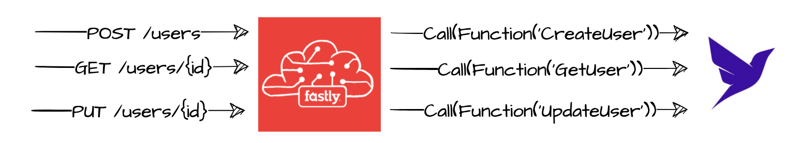

This repository contains unofficial patterns, sample code, or tools to help developers build more effectively with [Fauna][fauna]. All [Fauna Labs][fauna-labs] repositories are provided “as-is” and without support. By using this repository or its contents, you agree that this repository may never be officially supported and moved to the [Fauna organization][fauna-organization].

[fauna]: https://www.fauna.com/
[fauna-labs]: https://github.com/fauna-labs
[fauna-organization]: https://github.com/fauna

---

# Edge Gateway (Fastly)

> Generated using [Fastly starter kit](https://github.com/fastly/compute-starter-kit-javascript-default)

---

Example "Edge API Gateway" using Compute@Edge. In this sample, we implement `GET`, `PUT` and `POST` `/users` rest API endpoints using Fastly Compute@Edge, which provide the routing. The routes proxy requests to "resolvers" on the Fauna side, which are discussed in [this project](https://github.com/fauna-labs/vue-fauna-edge-api).



## Setup
> 🛑 Compute @ Edge is not a default feature and must be enabled on the back-end. 
> Contact Fastly to have this feature enabled in your account.

### 1. Create a Compute service:
* [Sign in](https://manage.fastly.com/auth/sign-in) to Fastly. Click [Create service] and choose **Compute**. 
* Navigate to **Origins > Hosts**. In the empty field), enter the *Hostname or IPv4 addres for the backend...*.
  Use one of these values depending on which Fauna 
  [Region Group](https://docs.fauna.com/fauna/current/learn/understanding/region_groups) 
  your database is in:

  | Region Group       | Hostname to enter in Fastly |
  | ------------------ | --------------------------- |
  | Classic            | `db.fauna.com`              |
  | United States (US) | `db.us.fauna.com`           |
  | Europe (EU)        | `db.eu.fauna.com`           |

* Change the default name of the host to **`host_fauna`**.
* Navigate to **Dictionaries** and click [Create your first dictionary]. Give it a name, e.g. `client_serverles_kv`
  * When the screen updates, click [Add item]. Set:
    * Key = **host_fauna**
    * Value = *<<same value as used for Hostname in the previous step. e.g. `db.eu.fauna.com`>>*
* Find the **ID** of this service at the top of the screen. Copy it and edit in `fastly.toml` with its value:
  ```
  service_id = "<<service id>>"
  ```

### 2. Generate a Personal API Token
From the top right corner of your Fastly dashboard, click on your username to activate the dropdown menu. 
Choose “Account” to enter the Account Settings page. Use the left navigator panel and select Personal API Tokens. 
Configure these settings:
> This token is used only to deploy the code from your local machine to Fastly. 
> The service itself, Compute @ Edge does not use this token.

* Provide a name. e.g. `client-serverless-api`.
* Service Access = **A specific service**. From the dropdown, select the service created in the previous step.
* Scope = **Global API access**
* Expiration = **Never expire**
* Click [Create Token]. On the next screen, copy the generated value and save it somewhere safe for future reference. 
  You won’t be able to access this value again. 

### 3. Deploy
* Set environment variable `FASTLY_API_TOKEN` to Personal API Token from the previous step.
  ```
  export FASTLY_API_TOKEN=<<token>>
  ```

* Install dependencies
  ```
  npm install
  ```

* Build
  ```
  fastly compute build
  ```

* Deploy
  ```
  fastly compute deploy
  ```
  When prompted to provide a domain, click Enter to accept the generated value. Wait a few seconds for the service to deploy. You should see the progress on the terminal.

## Next steps

At this point, `GET`, `PUT` and `POST` `/users` should be live but you still need to deploy the resolvers 
(Fauna User Defined Functions, UDFs) on Fauna. Hop over to 
[this project](https://github.com/fauna-labs/vue-fauna-edge-api#1-create-fauna-resources)
and complete the steps **1. Create Fauna Resources** and **2. Setup External Authentication with Auth0**
to finish the setup.
